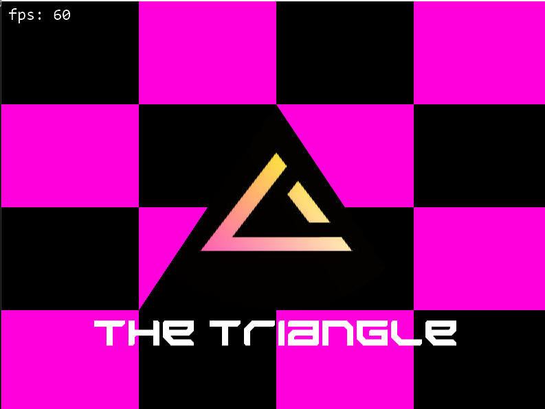
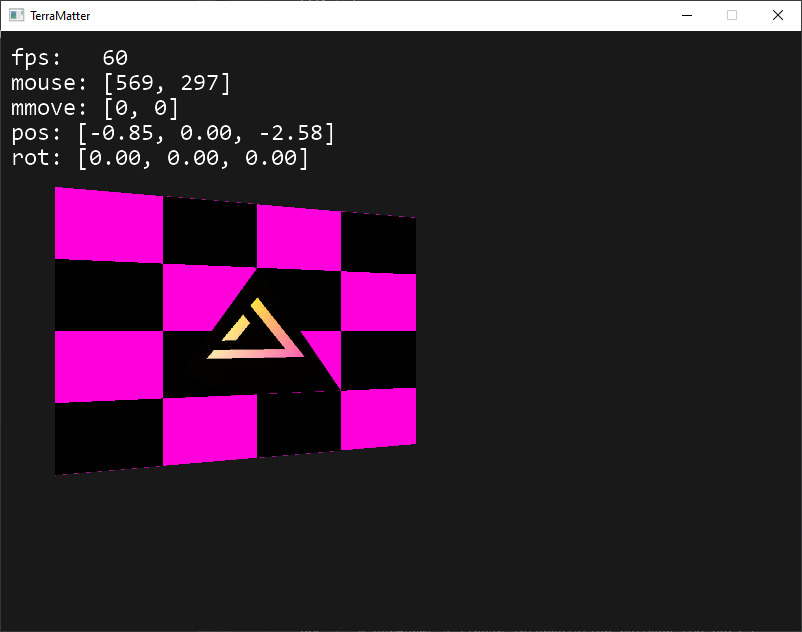
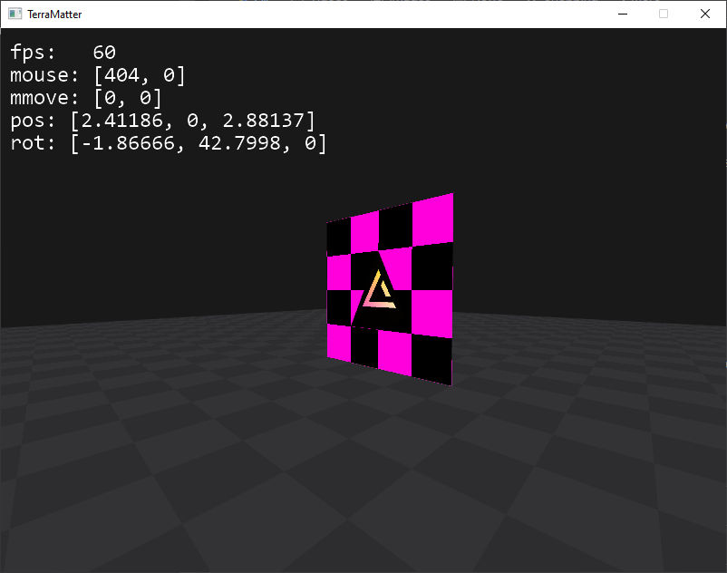
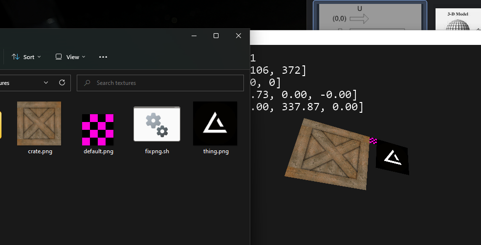
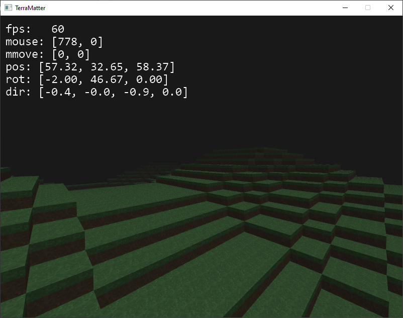

# Terramatter

This work is licensed under a <a rel="license" href="http://creativecommons.org/licenses/by-nc-nd/4.0/">Creative Commons Attribution-NonCommercial-NoDerivatives 4.0 International License (CC-BY-NC-ND)</a>.
________________

**Engine - Custom**

**Language - D**

**Source Code - Available: Latest version**

**Executables - None**

**Development Date - 2022**

________________

## Description
Attempt in creating minecraft clone from scratch. Project failed because I got stuck on mipmaps and they were driving me insane.

## Screenshots
Hello triangle

Perspective camera

 

Runtime atlas stitching

In-"game" graphics

